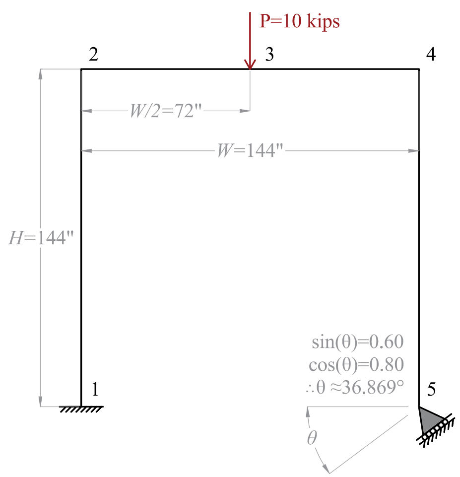

.. _constrain:

constrain
^^^^^^^^^

The ``constrain`` command imposes a multi-point constraint between two nodes.
When no rotation is specified, it behaves like :ref:`equalDOF`, constraining the degrees-of-freedom at the constrained node to equal those at the retained node.
When a rotation vector is provided, the constraint enforces a rotated relationship between the nodes through a rotation matrix.

.. tabs::

   .. tab:: Python

      .. py:method:: Model.constrain(rNode, cNode, rotate=None)

         Impose a multi-point constraint between a retained node and a constrained node.

         :param int|tuple rNode: integer tag identifying the retained node, or tuple (rNode, cNode) for both nodes
         :param int cNode: integer tag identifying the constrained node (required if rNode is not a tuple)
         :param list rotate: optional rotation vector [v1, v2, v3] representing axis-angle in radians (see :ref:`Rotation Vector <constrain-rotation-vector>` below). Only available for 3D problems (ndm=3, ndf=6).
         :return: None

   .. tab:: Tcl

      .. function:: constrain $rNodeTag $cNodeTag <-rotate {v1 v2 v3}>

      .. csv-table::
         :header: "Argument", "Type", "Description"
         :widths: 10, 10, 40

         $rNodeTag, |integer|, integer tag identifying the retained node (*rNode*)
         $cNodeTag, |integer|, integer tag identifying the constrained node (*cNode*)
         -rotate {v1 v2 v3}, |optional|, rotation vector representing axis-angle in radians (see :ref:`Rotation Vector <constrain-rotation-vector>` below). Only available for 3D problems (ndm=3, ndf=6).

Theory
------

The ``constrain`` command creates a multi-point constraint that enforces the relationship :math:`\boldsymbol{u}_c = \boldsymbol{C}_{cr} \boldsymbol{u}_r`, where :math:`\boldsymbol{u}_c` is the response vector at the constrained node, :math:`\boldsymbol{u}_r` is the response vector at the retained node, and :math:`\boldsymbol{C}_{cr}` is the constraint matrix.

.. _constrain-without-rotation:

Without Rotation
~~~~~~~~~~~~~~~~

When no rotation is specified, the constraint matrix is the identity matrix, resulting in behavior equivalent to :ref:`equalDOF`: :math:`\boldsymbol{C}_{cr} = \boldsymbol{I}`.
This form of the constraint works for both 2D and 3D problems.

With Rotation
~~~~~~~~~~~~~

When a rotation vector :math:`\boldsymbol{v} = [v_1, v_2, v_3]` is provided, the rotation matrix :math:`\boldsymbol{R}` is computed using `Rodrigues' rotation formula <https://en.wikipedia.org/wiki/Rodrigues%27_rotation_formula#:~:text=In%20terms%20of%20the%20matrix%20exponential%2C>`_ as the matrix exponential :math:`\boldsymbol{R} = \exp(\theta \boldsymbol{K})`, where :math:`\theta` is the magnitude of the rotation vector and :math:`\boldsymbol{K}` is the skew-symmetric matrix corresponding to the normalized rotation axis.

.. _constrain-rotation-vector:

Rotation Vector
~~~~~~~~~~~~~~~

The rotation vector uses the **axis-angle representation**: the normalized direction defines the rotation axis, and the magnitude is the rotation angle in radians. The rotation follows the **right-hand rule**: a positive angle rotates counterclockwise when viewed from the tip of the axis vector.

In 3D models, the components :math:`[v_1, v_2, v_3]` correspond to rotations about the global X, Y, and Z axes respectively:
- :math:`[\theta, 0, 0]` rotates about the X-axis
- :math:`[0, \theta, 0]` rotates about the Y-axis
- :math:`[0, 0, \theta]` rotates about the Z-axis

The coordinate system and degrees-of-freedom conventions are documented in :ref:`Conventions <conventions>`.

For 3D problems (ndm=3, ndf=6), the constraint matrix is:

.. math::

   \boldsymbol{C}_{cr} = \begin{bmatrix}
          \boldsymbol{R} & \boldsymbol{0} \\
          \boldsymbol{0} & \boldsymbol{R}
   \end{bmatrix}

where the upper-left block applies the rotation matrix :math:`\boldsymbol{R}` to translational degrees-of-freedom (1-3), and the lower-right block applies the same rotation matrix to rotational degrees-of-freedom (4-6).

.. note::

   **3D limitation:** The rotation option is only implemented for 3D problems (ndm=3, ndf=6) because Rodrigues' formula requires a 3D rotation vector, and the constraint matrix applies the rotation to all six degrees-of-freedom.

   **2D alternative:** For 2D problems requiring rotated constraints (e.g., skewed supports), use the penalty method with :ref:`zeroLength <zeroLength>` elements, as demonstrated in the :ref:`Penalty Method for Skewed Supports in 2D <zeroLength-penalty-2d>` example.

   **Rotational DOF approximation:** The same rotation matrix :math:`\boldsymbol{R}` is applied to both translational and rotational DOFs. While this is a proper coordinate transformation for translational DOFs, it is an approximation for rotational DOFs (treating rotations as vectors) that is valid for small rotations but may have limitations for large finite rotations.

Examples
--------

Basic Constraint (No Rotation)
~~~~~~~~~~~~~~~~~~~~~~~~~~~~~~~

This example demonstrates the basic usage of ``constrain`` without rotation, corresponding to the :ref:`Without Rotation <constrain-without-rotation>` theory section above. When no rotation is specified, the constraint matrix is the identity matrix :math:`\boldsymbol{C}_{cr} = \boldsymbol{I}`, making this equivalent to :ref:`equalDOF`.

The following example constrains node **5** to have the same degrees-of-freedom as node **100**. This works for both 2D and 3D problems:

.. tabs::
   .. tab:: Python

      .. code-block:: python

         model.constrain(100, 5)

   .. tab:: Tcl

      .. code-block:: none

         constrain 100 5

Constraint with Rotation
~~~~~~~~~~~~~~~~~~~~~~~~~

The following example constrains node **5** to node **100** with a rotation about the Y-axis. This requires a 3D model (ndm=3, ndf=6):

.. tabs::
   .. tab:: Python

      .. code-block:: python

         angle = 0.5  # Rotation angle in radians (about 28.6 degrees)
         # Negative sign rotates clockwise about Y-axis (right-hand rule)
         model.constrain(100, 5, rotate=[0, -angle, 0])

   .. tab:: Tcl

      .. code-block:: none

         constrain 100 5 -rotate {0 -0.6435 0}

Frame with Skewed Support
~~~~~~~~~~~~~~~~~~~~~~~~~~

This example demonstrates using ``constrain`` to model a frame with a skewed support in 3D, where the support is not aligned with the global coordinate system.

   Frame with skewed support: geometry, dimensions (H, W), mid-span load P, and skewed support angle θ.

.. code-block:: python
   :linenos:

   import xara
from xara.units.english import inch, kip, ksi
from math import atan2
import numpy as np
import veux
from shps.rotor import exp

# Geometry
H = 144.0 * inch
W = 144.0 * inch

# Section properties
width = 12.0 * inch
height = 12.0 * inch
Iz = (width * height**3) / 12.0
Iy = (height * width**3) / 12.0
A = width * height
J = (width * height**3) / 3.0

# Material
E = 29000 * ksi
G = 11500 * ksi
nu = 0.30

k_penalty = 1.0e10 * kip / inch

# Load
P = -10.0 * kip
angle = atan2(0.6, 0.8) # 0.6435011088 # radians

Reference = {
    (1, 2): 5.811,
    (4, 2): 5.236
}

expected_Fz_jt1 = 5.811
expected_F3_jt4 = 5.236

def error(value, reference):
    return abs(value - reference) / reference * 100.0

def run_penalty_2d():
    # Model
    model = xara.Model('basic', ndm=2, ndf=3)

    # Nodes
    model.node(1, (0.0, 0.0))      # Fixed support
    model.node(2, (0.0, H))        # Top-left
    model.node(3, (W/2, H))        # Load point
    model.node(4, (W,   H))        # Top-right
    model.node(5, (W, 0.0))        # Skewed support

    # Fixed support at node 1
    model.fix(1, (1, 1, 1))

    # Skewed support at node 5 using penalty method
    cos_theta = 0.8
    sin_theta = 0.6

    R = exp([0.0, 0.0, angle])
    ground_node = 100
    model.node(ground_node, (W, 0.0))
    model.fix(ground_node, (1, 1, 1))

    k_penalty = 1.0e10 * kip / inch
    model.uniaxialMaterial('Elastic', 1001, k_penalty)

    # Normal direction for constraint
    nx, ny, = R[:2,0]
    tx, ty = cos_theta, sin_theta

    model.element('zeroLength', 1001, (ground_node, 5), 
                  mat=1001, 
                  dir=2,
                  orient=(nx, ny, 0.0, tx, ty, 0.0))

    # Frame section and elements
    model.material('ElasticIsotropic', 1, E, nu)
    model.section("ElasticFrame", 1, E=E, G=G, A=A, Iy=Iy, Iz=Iz, J=J)
    model.geomTransf("Linear", 1)

    model.element('PrismFrame', 1, (1, 2), section=1, transform=1)
    model.element('PrismFrame', 2, (2, 3), section=1, transform=1)
    model.element('PrismFrame', 3, (3, 4), section=1, transform=1)
    model.element('PrismFrame', 4, (4, 5), section=1, transform=1)

    # Load
    model.timeSeries('Constant', 1)
    model.pattern('Plain', 1, 1)
    model.load(3, (0.0, P, 0.0))

    # Analysis
    model.system('BandGeneral')
    model.numberer('RCM')
    model.constraints('Transformation')
    model.integrator('LoadControl', 1.0)
    model.algorithm('Newton')
    model.test('Energy', 1e-10, 10)
    model.analysis('Static')
    model.analyze(1)

    # Results

    print("\n" + "="*60)
    print("Model E: Skewed Support - Example 1-005e")
    print("="*60)

    # Reactions
    model.reactions()
    Fz_jt1 = model.nodeReaction(1, 2)/kip
    R4 = model.nodeReaction(ground_node)[:2]
    r4 = R[:2,:2].T @ R4 / kip
    F3_jt4 = r4[1]

    # Verification
    print("\n" + "-"*60)
    print("Verification against Example 1-005e:")
    print("-"*60)

    error_Fz = error(Fz_jt1, expected_Fz_jt1)*100 
    error_F3 = error(F3_jt4, expected_F3_jt4)*100 

    print(f"  Fz (jt. 1):  {Fz_jt1:8.3f} kip  (expected {expected_Fz_jt1:.3f})  Error: {error_Fz:.2f}%")
    print(f"  F3 (jt. 4):  {F3_jt4:8.3f} kip  (expected {expected_F3_jt4:.3f})  Error: {error_F3:.2f}%")

    if error_Fz < 1.0 and error_F3 < 1.0:
        print("\nPASSED")
    else:
        print("\nFAILED")

    print("="*60)
    

def run_penalty_3d():
    # Model

    model = xara.Model('basic', ndm=3, ndf=6)

    # Nodes
    model.node(1, (0.0, 0.0, 0.0))      # Fixed support
    model.node(2, (0.0, 0.0, H))        # Top-left
    model.node(3, (W/2, 0.0, H))        # Load point
    model.node(4, (W,   0.0, H))        # Top-right
    model.node(5, (W,   0.0, 0.0))      # Skewed support

    # Fixed support at node 1
    model.fix(1, (1, 1, 1, 1, 1, 1))

    # Skewed support at node 5 using penalty method

    R = exp([0.0, -angle, 0.0])
    ground_node = 100
    model.node(ground_node, (W, 0.0, 0.0))
    model.fix(ground_node,  (1, 1, 1, 1, 1, 1))

    model.uniaxialMaterial('Elastic', 1001, k_penalty)

    # Normal direction for constraint
    nx, ny, nz = R[:,0] # == R @ [1, 0, 0] == R*Ex
    tx, ty, tz = R[:,1]

    model.element('zeroLength', 1001, (ground_node, 5), 
                  mat=1001, 
                  dir=3,
                  orient=(nx, ny, nz, tx, ty, tz))

    # Frame section and elements
    model.material('ElasticIsotropic', 1, E, nu)
    model.section("ElasticFrame", 1, E=E, G=G, A=A, Iy=Iy, Iz=Iz, J=J)
    model.geomTransf("Linear", 1, (0, 1, 0)) # Columns
    model.geomTransf("Linear", 2, (0, 1, 0)) # Beams

    model.element('PrismFrame', 1, (1, 2), section=1, transform=1)
    model.element('PrismFrame', 2, (2, 3), section=1, transform=2)
    model.element('PrismFrame', 3, (3, 4), section=1, transform=2)
    model.element('PrismFrame', 4, (4, 5), section=1, transform=1)

    # Load
    model.timeSeries('Constant', 1)
    model.pattern('Plain', 1, 1)
    model.load(3, (0.0, 0.0, P, 0.0, 0.0, 0.0))

    # Analysis
    model.system('BandGeneral')
    model.numberer('RCM')
    model.integrator('LoadControl', 1.0)
    model.algorithm('Newton')
    model.test('Energy', 1e-8, 10)
    model.analysis('Static')
    model.analyze(1)

    # Results

    print("\n" + "="*60)
    print("Model E: Skewed Support - Example 1-005e")
    print("="*60)

    # Reactions
    model.reactions()
    Fz_jt1 = model.nodeReaction(1, 3)/kip
    R4 = model.nodeReaction(ground_node)[:3]
    r4 = R.T @ R4 / kip
    F3_jt4 = r4[2]

    # Verification
    print("\n" + "-"*60)
    print("Verification against Example 1-005e:")
    print("-"*60)

    error_Fz = error(Fz_jt1, expected_Fz_jt1)*100 
    error_F3 = error(F3_jt4, expected_F3_jt4)*100 

    print(f"  Fz (jt. 1):  {Fz_jt1:8.3f} kip  (expected {expected_Fz_jt1:.3f})  Error: {error_Fz:.2f}%")
    print(f"  F3 (jt. 4):  {F3_jt4:8.3f} kip  (expected {expected_F3_jt4:.3f})  Error: {error_F3:.2f}%")

    if error_Fz < 1.0 and error_F3 < 1.0:
        print("\nPASSED")
    else:
        print("\nFAILED")

def run_constrain_3d(constraint_solver):
    # Model

    model = xara.Model('basic', ndm=3, ndf=6)

    # Nodes
    model.node(1, (0.0, 0.0, 0.0))      # Fixed support
    model.node(2, (0.0, 0.0, H))        # Top-left
    model.node(3, (W/2, 0.0, H))        # Load point
    model.node(4, (W,   0.0, H))        # Top-right
    model.node(5, (W,   0.0, 0.0))      # Skewed support

    # Fixed support at node 1
    model.fix(1, (1, 1, 1, 1, 1, 1))

    # Skewed support at node 5 using penalty method

    R = exp([0.0, -angle, 0.0])
    ground_node = 100
    model.node(ground_node, (W, 0.0, 0.0))
    model.fix(ground_node,  (0, 1, 1, 0, 0, 0))

    model.constrain((ground_node, 5), rotate=[0, -angle, 0])

    # Frame section and elements
    model.material('ElasticIsotropic', 1, E, nu)
    model.section("ElasticFrame", 1, E=E, G=G, A=A, Iy=Iy, Iz=Iz, J=J)
    model.geomTransf("Linear", 1, (0, 1, 0)) # Columns
    model.geomTransf("Linear", 2, (0, 1, 0)) # Beams

    model.element('PrismFrame', 1, (1, 2), section=1, transform=1)
    model.element('PrismFrame', 2, (2, 3), section=1, transform=2)
    model.element('PrismFrame', 3, (3, 4), section=1, transform=2)
    model.element('PrismFrame', 4, (4, 5), section=1, transform=1)

    # Load
    model.timeSeries('Constant', 1)
    model.pattern('Plain', 1, 1)
    model.load(3, (0.0, 0.0, P, 0.0, 0.0, 0.0))

    # Analysis
    model.system('BandGeneral')
    model.numberer('RCM')
    model.constraints(constraint_solver)
    model.integrator('LoadControl', 1.0)
    model.algorithm('Newton')
    model.test('Energy', 1e-8, 10)
    model.analysis('Static')
    model.analyze(1)

    # Results

    print("\n" + "="*60)
    print("Model E: Skewed Support - Example 1-005e")
    print("="*60)

    # Reactions
    model.reactions()
    Fz_jt1 = model.nodeReaction(1, 3)/kip
    R4 = model.nodeReaction(5)[:3]
    r4 = R.T @ R4 / kip
    F3_jt4 = r4[2]
    print(f"R4: {R4}, r4: {r4}")

    # Verification
    print("\n" + "-"*60)
    print("Verification against Example 1-005e:")
    print("-"*60)

    error_Fz = error(Fz_jt1, expected_Fz_jt1)*100 
    error_F3 = error(F3_jt4, expected_F3_jt4)*100 

    print(f"  Fz (jt. 1):  {Fz_jt1:8.3f} kip  (expected {expected_Fz_jt1:.3f})  Error: {error_Fz:.2f}%")
    print(f"  F3 (jt. 4):  {F3_jt4:8.3f} kip  (expected {expected_F3_jt4:.3f})  Error: {error_F3:.2f}%")

    if error_Fz < 1.0 and error_F3 < 1.0:
        print("\nPASSED")
    else:
        print("\nFAILED")

    print("="*60)

if __name__ == "__main__":
    run_penalty_2d()
    run_penalty_3d()
    run_constrain_3d('Transformation')
    run_constrain_3d('Auto')
References
----------

*  Cook, R.D., Malkus, D.S., Plesha, M. E., and Witt, R. J., "Concepts and Applications of Finite Element Analysis," 4th edition, John Wiley and Sons publishers, 2002.

*  `Rodrigues' rotation formula <https://en.wikipedia.org/wiki/Rodrigues%27_rotation_formula>`_ - Wikipedia article on Rodrigues' rotation formula.

